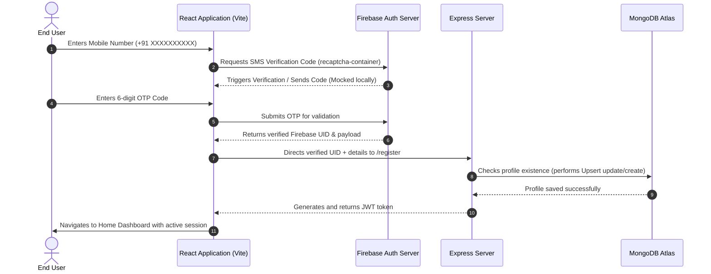

# Travelwise - Firebase Phone Authentication & Profile Integration

A high-performance, pixel-perfect, and modern travel web application featuring a secure and user-friendly Phone Authentication flow using Firebase Web SDK and a Node.js/Express/MongoDB backend database.

---

## 🚀 Project Overview
**Travelwise** provides users with a seamless, passwordless login experience. Rather than traditional passwords, authentication relies on a verified phone number. The project demonstrates:
1. Verification of the user's mobile number via Firebase Phone Authentication.
2. Generating/resolving Firebase verification tokens on the client.
3. Validating credentials and storing persistent profiles (names, emails, active tokens) in a custom MongoDB database.
4. Dynamic routing directing users seamlessly through: **Login ➔ OTP Verification ➔ Profile Setup ➔ Home Dashboard**.

---

## 🛠️ Tech Stack

### Frontend
- **Framework**: React 19 (TypeScript)
- **Build Tool**: Vite
- **Styling**: Tailwind CSS (v4)
- **Routing**: React Router DOM (v7)
- **Forms**: React Hook Form
- **Auth Provider**: Firebase Web SDK (v11+)

### Backend
- **Runtime**: Node.js & TypeScript
- **Framework**: Express.js
- **Database**: MongoDB Atlas (via Mongoose)
- **Token System**: JSON Web Tokens (JWT)
- **Dev Tools**: `ts-node-dev` for hot restarts

---

## 📂 Folder Structure

```text
Otp/
├── backend/                  # Express.js Backend Server
│   ├── src/
│   │   ├── config/           # Database Connection
│   │   ├── controllers/      # Route Controller Handlers (loginVerify, register, getMe)
│   │   ├── middleware/       # Authentication Checkers
│   │   ├── models/           # Mongoose Schemas (User)
│   │   ├── routes/           # Router Mounting
│   │   ├── utils/            # JWT generators
│   │   ├── app.ts            # Express App Configuration
│   │   └── server.ts         # Server Entry Point
│   ├── .env                  # Port & Database Secrets
│   ├── package.json
│   └── tsconfig.json         # TypeScript Compiler Config
│
└── phone-auth-app/           # React Frontend Application
    ├── src/
    │   ├── assets/           # Premium illustrations & design logos
    │   ├── components/       # Custom reusable inputs, buttons, and Toast Notifications
    │   ├── firebase/         # Firebase app configuration & Auth helpers
    │   ├── pages/            # Page layouts: Login, OTP, Register, Home
    │   ├── routes/           # React Router mappings
    │   ├── App.tsx           # App Router & Toast Context Wrapper
    │   ├── index.css         # Styling, Keyframes, Custom fonts
    │   └── main.tsx          # Client Entry Point
    ├── package.json
    └── vite.config.ts
```

---

## 🔧 Installation

Make sure you have Node.js (v18+) and npm installed on your machine.

### 1. Clone the project and install dependencies
For both directories, run the install command:

```bash
# Install backend dependencies
cd backend
npm install

# Install frontend dependencies
cd ../phone-auth-app
npm install
```

### 2. Configure Environment Variables

Create a `.env` file in the **backend** directory:
```env
PORT=5000
MONGODB_URI=your_mongodb_connection_string
JWT_SECRET=your_jwt_secret_key
```

Create a `.env` file in the **phone-auth-app** directory:
```env
VITE_FIREBASE_API_KEY=your_firebase_api_key
VITE_FIREBASE_AUTH_DOMAIN=your_firebase_auth_domain
VITE_FIREBASE_PROJECT_ID=your_firebase_project_id
VITE_FIREBASE_STORAGE_BUCKET=your_firebase_storage_bucket
VITE_FIREBASE_MESSAGING_SENDER_ID=your_firebase_messaging_sender_id
VITE_FIREBASE_APP_ID=your_firebase_app_id
```

---

## 🏃 How to Run

### Start the Backend Server:
```bash
cd backend
npm run dev
```
The server will boot and connect to MongoDB at `http://localhost:5000`.

### Start the Frontend Application:
```bash
cd phone-auth-app
npm run dev
```
Open the provided browser URL (typically `http://localhost:5173` or `http://localhost:5177`).

---

## 🔥 Firebase Setup

To support SMS phone authentication, complete these steps in your Firebase Console:

1. **Enable Phone Authentication**:
   - Go to **Security > Authentication > Sign-in method**.
   - Enable **Phone** provider.
2. **Authorize Host Domain**:
   - In **Settings > Authorized domains**, make sure `localhost` is added.
3. **SMS Region Policy**:
   - In **Settings > SMS region policy**, configure allowed country codes (e.g. enabling India `+91` or USA `+1`).
4. **App Verification for Testing**:
   - The app has `appVerificationDisabledForTesting = true` enabled locally. This bypasses structural reCAPTCHA puzzles, allowing instant verification during development.

---

## 🧪 Testing Credentials

Use the following fictional credentials already configured in Firebase Console for testing the login flow without needing real SMS messages:

| Fictional Phone Number | Test OTP Code | Account Status in MongoDB | Expected Action |
| :--- | :--- | :--- | :--- |
| **`+91 89434 91009`** | `098765` | New / Not Registered | Redirection to Register profile |
| **`+91 90729 99456`** | `123456` | New / Not Registered | Redirection to Register profile |

---

## ✨ Features

- **Invisible reCAPTCHA**: Automatic background bot protection. No puzzles or challenges shown to users during standard verification runs.
- **6-Digit Input Grid**: Auto-focus forward and backward backspace movements supporting standard verification formats.
- **Single OTP Registration**: Once the phone number is verified during sign-in, the profile page allows immediate database onboarding without requiring a second SMS verification code.
- **Dynamic Upserts**: Submitting the profile will create a new database profile or update details for returning users seamlessly.
- **Custom Toast Popups**: Styled, animated context-based notifications for success confirmations or errors.
- **Secure Sessions**: Persisted JWT tokens keep users logged in across refreshes.

---

## 🏗️ Architecture



---

## 🔮 Future Improvements

1. **Multi-Factor Auth (MFA)**: Supplement SMS authentication with biometric or authenticator app confirmations.
2. **SMS Abuse Shield**: Integrate rate-limiting middleware (like `express-rate-limit`) on backend verification endpoints to prevent API spamming.
3. **SMS Custom Templates**: Configure custom branding message logs in Firebase to personalize SMS texts.
4. **Image Uploads**: Support profile avatar uploads directly to cloud buckets.
